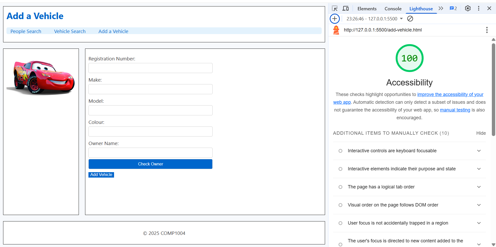
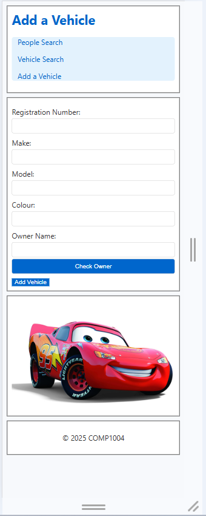
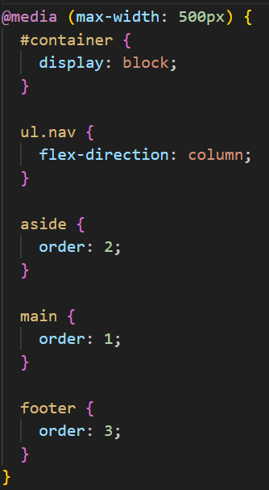

# COMP1004 Coursework

# Hiren Mistry 20565240

This project is a 3-page responsive website for vehicle registration and lookup, built using:
- HTML, CSS, JavaScript (frontend)
- Supabase (backend database + API)
- Playwright and Lighthouse(for testing)

## Features

- **People Search** – Find people by name or license number
- **Vehicle Search** – Search vehicles by registration number
- **Add a Vehicle** – Link a new vehicle to an existing or new owner

## Technologies Used

| Layer       | Tech                             |
|-------------|----------------------------------|
| Frontend    | HTML, CSS Grid & Flexbox, JavaScript    |
| Backend     | Supabase (PostgreSQL + REST API) |
| Testing     | Playwright & LightHouse                    |

## Supabase Configuration

- **Database Tables**:
  - `People`: stores owners with fields like `PersonID`, `Name`, `LicenseNumber`, etc.
  - `Vehicle`: stores vehicles with `VehicleID`, `Make`, `Model`, and `OwnerID` (foreign key)

- **Relationships**:
  - `Vehicle.OwnerID` → foreign key referencing `People.PersonID`
  
- **RLS Policies**:
  - SELECT and INSERT enabled for both `People` and `Vehicle` tables

## Testing & Results

### HMTL

## Accessibility Improvements

To improve accessibility i had to make, several enhancements were made across the application’s HTML files. These changes also improved the accessibility score to 100%

---

### 1. Semantic HTML Structure

- Used semantic tags such as `<header>`, `<nav>`, `<main>`, and `<footer>` to provide a clear and logical page structure.
- Helps screen readers navigate pages more effectively using landmarks.

**Files and Locations:**

| File                | Lines     | Description                         |
|---------------------|-----------|-------------------------------------|
| `index.html`        | 13–20     | Header and navigation using `<header>` and `<ul>` |
| `vehicle.html`      | 13–20     | Same structure reused for consistency |
| `add-vehicle.html`  | 13–20     | Semantic layout repeated across page |

---

### 2. Proper Use of `<label>` and `id`

- All form inputs use `<label for="...">` elements linked to matching `id` attributes.
- Improves screen reader compatibility and input field accessibility.

**Examples:**

| File                | Lines     | Description                         |
|---------------------|-----------|-------------------------------------|
| `index.html`        | 22–28     | Label for name search input         |
| `vehicle.html`      | 22–26     | Label for vehicle registration field |
| `add-vehicle.html`  | 22–49     | Labels for all owner and vehicle form fields |

---

### 3. Descriptive Button Text and Roles

- All buttons and links include clear, descriptive text (e.g., “Submit”, “Check owner”, “Add vehicle”).
- Avoids generic or ambiguous labels such as “Click here”.

**File and Location:**

| File                | Lines     | Examples                            |
|---------------------|-----------|-------------------------------------|
| `add-vehicle.html`  | 21–52     | Buttons for submitting vehicle and owner information |

---

### 4. Alt Text for Images

- All images include meaningful `alt` attributes to describe their purpose or content.

**File:** `add-vehicle.html`  
**Line:** ~54
**Example:**

``

### CSS

- To acheive a responsive layout i set the max width to `500px` and made to sure put the `navbar`, `main content`, `sidebar` and `footer` in the layout for a mobile screen. Doing all these steps would ensure i would meet the requirements for the website. This is the code i used to acheive a responsive layout:

- When doing my `CSS` for the responsive layout i made sure in the `container` tag i used `display: block;` so website will used the full width of the screen and it will block the display value and start an new line. Also i used `flex-direction: column;` for the `navbar` so each link will be on top of each other if the user is using a mobile device.

- With use of CSS i also added some extra elements to my website like using `.hover` on my navbar. This would make the navbar animated so when the user hovers over the navbar it would highlight and have a bold underline under it.

## JavaScript & Database Testing 

This section documents the Playwright tests used to validate the application's functionality, including correct usage and exception handling.

### 1. People Search (`index.html`)

**Tested Scenarios:**

| Condition                 | Description                               | Result  |
|--------------------------|-------------------------------------------|---------|
| Valid name entered     | `"Rachel"` returns two matching records    | Pass |
| Valid license entered  | Returns correct person                     | Pass |
| No match               | Returns "No results found"                 | Pass |
| Empty input            | Handles gracefully, no crash               | Pass |

**Test Location:**  
**File**: `tests/coursework-sample.spec`  
**Lines**: `99-105`

---

### 2. Vehicle Search (`vehicle.html`)

**Tested Scenarios:**

| Condition                | Description                                        | Result  |
|-------------------------|----------------------------------------------------|---------|
| Valid rego entered    | `"KWK24JI"` returns Tesla with no owner            | Pass |
| Unknown rego          | Returns "No results found"                         | Pass |
| Empty input           | Gracefully handled                                 | Pass |
| Invalid type          | Non-crashing, safe handling of malformed input     | Pass |

**Test Location:**  
**File**: `tests/coursework-sample.spec`  
**Lines**: `108–114`

---

### 3. Add a Vehicle (`add-vehicle.html`)

### Valid Scenario

| Condition               | Description                                   |
|------------------------|-----------------------------------------------|
| All fields valid       | Adds new vehicle with owner successfully      |

### Exception Scenarios

| Condition                     | Description                                               | Result  |
|------------------------------|-----------------------------------------------------------|---------|
| Missing vehicle fields     | Prevents insert, shows error                              | Pass |
| Missing owner fields       | Insert blocked, error displayed in `#message-owner`       | Pass |
| Duplicate license number   | Insert rejected with `409 Conflict`                       | Pass |
| Duplicate vehicle rego     | Insert rejected with `409 Conflict`                       | Pass |
| Wrong data type (e.g. number for colour) | Still accepted (no strict validation)         | Pass |
| No owner selected          | Prevents insert, error shown                              | Pass |
| RLS or insert failure      | `Error` message shown in UI                               | Pass |

**Test Location:**  
**File**: `tests/coursework-sample.spec`  
**Lines**: `117–139`

### Exception Types Covered

- [x] Missing required fields
- [x] Duplicate key (primary/unique)
- [x] Invalid data types
- [x] Empty inputs
- [x] Foreign key constraint
- [x] RLS (row-level security) rejection
- [x] All successful input paths

